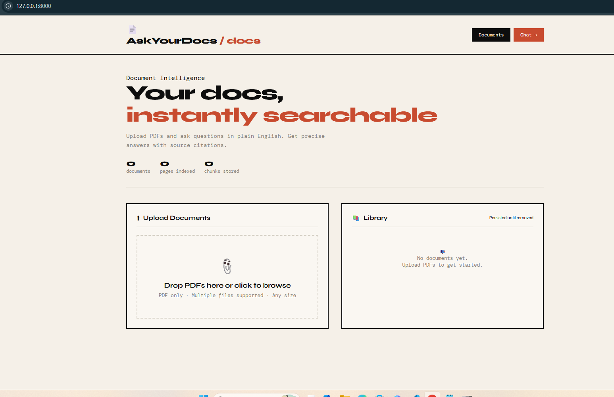
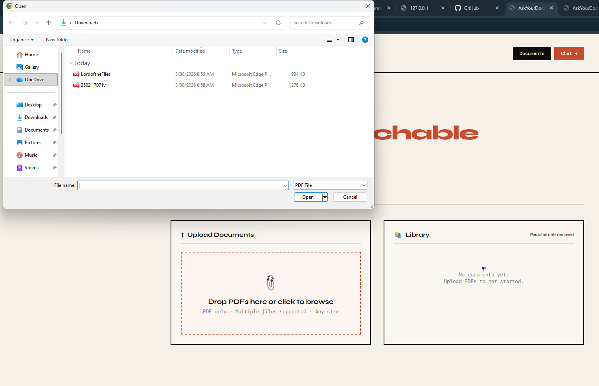

# AskYourDocs

**Turn your PDFs into instant answers.** Upload documents, ask questions in plain English, and get precise answers with exact page citations — powered by a RAG (Retrieval-Augmented Generation) pipeline and Groq's fast inference API.

---

## What it does

AskYourDocs lets you upload any PDF and have a conversation with it. Instead of scrolling through hundreds of pages, you ask a question and the app retrieves the most relevant chunks, passes them to an LLM, and returns a cited answer pointing to the exact pages it used.

**Tested with real documents:**
- Academic research papers (RAG for Radiology Report Generation)
- Full-length novels (Lord of the Flies, 251 pages)
- Technical reports and whitepapers

---

## Screenshots

### Documents Page
Upload PDFs and manage your library. Stats update live as documents are ingested.





### Chat Page
Ask questions across one or multiple documents. Answers include source chips showing which document and page each claim came from.

.png)
.png)
.png)
.png)


---

## Features

- **PDF upload** — drag & drop or click to browse, multiple files supported
- **Automatic ingestion** — text extraction, chunking, and vector indexing on upload
- **Multi-document chat** — select any combination of documents as context
- **Cited answers** — every response includes source chips (filename + page number)
- **Chat history** — the model is aware of previous turns in the conversation
- **Document library** — persistent storage, download original PDF or extracted text
- **Sample questions** — quick-start prompts on the chat welcome screen

---

## Tech Stack

| Layer | Technology |
|---|---|
| Backend | FastAPI (Python) |
| LLM Inference | Groq API |
| PDF Parsing | PyMuPDF |
| Embeddings / Retrieval | scikit-learn (TF-IDF cosine similarity) |
| Frontend | Vanilla HTML/CSS/JS |
| Server | Uvicorn |

---

## Project Structure

```
AskYourDocs/
│
├── backend/
│   ├── main.py              # FastAPI app, all routes
│   ├── config.py            # Settings & constants
│   ├── rag/
│   │   ├── __init__.py
│   │   ├── ingest.py        # PDF → chunks → TF-IDF index
│   │   ├── retrieve.py      # BM25/cosine similarity search
│   │   ├── llm.py           # Anthropic Claude API calls
│   │   └── pipeline.py      # Orchestrates ingest+retrieve+llm
│   ├── utils/
│   │   ├── __init__.py
│   │   ├── pdf_loader.py    # PyMuPDF text extraction
│   │   └── text_splitter.py # Chunk text with overlap
│   ├── storage/
│   │   ├── docs/            # Original PDFs
│   │   ├── indexes/         # Pickled TF-IDF indexes per doc
│   │   └── texts/           # Extracted text chunks (JSON)
│   └── requirements.txt
│
├── frontend/
│   ├── index.html           # Upload + document manager
│   ├── chat.html            # Chat interface
│   ├── app.js               # Shared JS logic
│   └── style.css            # Global styles
│
└── README.md
```

---

## Getting Started

### 1. Clone the repo

```bash
git clone https://github.com/yourusername/AskYourDocs.git
cd AskYourDocs
```

### 2. Install dependencies

```bash
pip install -r requirements.txt
```

### 3. Set up environment variables

Create a `.env` file in the project root:

```env
GROQ_API_KEY=your_groq_api_key_here
```

Get a free API key at [console.groq.com](https://console.groq.com).

### 4. Start the server

```bash
cd Backend
python -m uvicorn main:app --reload
```

### 5. Open the app

Go to [http://127.0.0.1:8000](http://127.0.0.1:8000)

---

## Usage

1. **Upload** — Go to the Documents page and drop a PDF into the upload zone
2. **Wait** — The document is parsed, chunked, and indexed (a few seconds)
3. **Chat** — Click "Chat →", make sure your document is selected in the sidebar
4. **Ask** — Type any question. The answer will cite exact pages from your document

### Example questions that work well

- *Summarize the key findings*
- *What methodology was used?*
- *What are the main conclusions?*
- *List all recommendations*

Basically any questions regarding the PDF you upload on the system. 

---

## API Endpoints

| Method | Endpoint | Description |
|---|---|---|
| `POST` | `/api/upload` | Upload and ingest a PDF |
| `GET` | `/api/documents` | List all documents |
| `DELETE` | `/api/documents/{id}` | Remove a document |
| `GET` | `/api/documents/{id}/download` | Download original PDF |
| `GET` | `/api/documents/{id}/text` | Download extracted text |
| `POST` | `/api/chat` | Send a chat message |
| `GET` | `/api/health` | Health check |

### Chat request body

```json
{
  "query": "What is RAG?",
  "doc_ids": ["a1b2c3d4"],
  "chat_history": [
    { "role": "user", "content": "..." },
    { "role": "assistant", "content": "..." }
  ]
}
```

---

## Configuration

Edit `Backend/config.py` to tune the RAG pipeline:

```python
GROQ_MODEL    = "llama-3.3-70b-versatile"  # LLM model
CHUNK_SIZE    = 800    # Characters per chunk
CHUNK_OVERLAP = 150    # Overlap between chunks
TOP_K_CHUNKS  = 6      # Chunks retrieved per query
MAX_TOKENS    = 2048   # Max LLM response length
```

**Other Groq models you can use:**

| Model | Best for |
|---|---|
| `llama-3.3-70b-versatile` | Best quality (default) |
| `llama-3.1-8b-instant` | Fastest responses |
| `mixtral-8x7b-32768` | Large context (32k tokens) |

---

## Requirements

- Python 3.9+ (tested on 3.14)
- Groq API key (free tier available)
- Windows / macOS / Linux

---

## Known Limitations

- PDF only — no Word, Excel, or image files
- Text-based PDFs only — scanned/image PDFs are not supported
- No user authentication — single-user local deployment
- Retrieval uses TF-IDF, not semantic embeddings

---

## License

MIT
